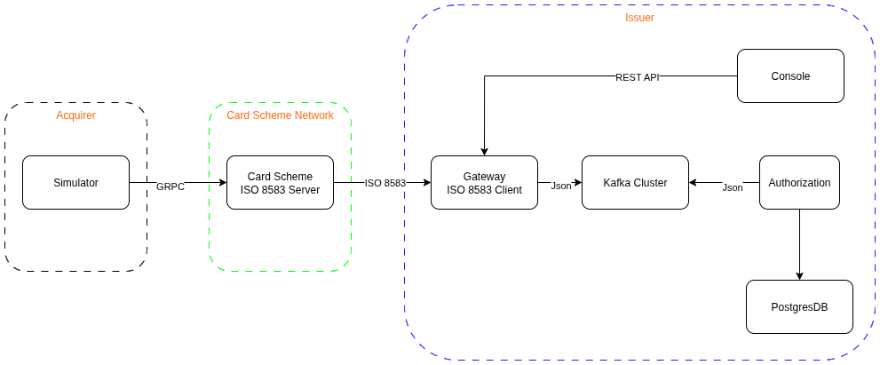

# ISO 8583 Demo Project
This project simulate the ISO-8583 transaction flow. Contain common domain: issuing bank, accquiring bank and card network scheme. The main purpose of this project is create a sample payment transaction environment. Help me easier to build and practice DevOps.

## Architecture Overview



## Modules

### 1. Common Module
**Purpose**: Shared ISO 8583 message models and parsing utilities
- `Iso8583Message`: Core message model with field mapping
- `Iso8583Parser`: Message parsing and field extraction utilities

### 2. Client Module
**Purpose**: REST API gateway for web console interaction
- **Port**: 8081
- **Features**:
  - Connection management API
  - Message sending endpoints
  - Optional Kafka integration for authorization
- **Key Endpoints**:
  - `POST /api/connections` - Create ISO connection
  - `DELETE /api/connections/{id}` - Close connection
  - `POST /api/connections/{id}/send` - Send ISO message

### 3. Server Module
**Purpose**: ISO 8583 message processing server
- **ISO Port**: 8583 (Netty socket server)
- **gRPC Port**: 9090 (Manual gRPC server)
- **Features**:
  - Netty-based socket server with 2-byte length prefix
  - gRPC server for simulator communication
  - Message processing and routing

### 4. Authorize Module
**Purpose**: Transaction authorization service
- **Features**:
  - Kafka consumer for authorization requests
  - Authorization logic processing
  - Response publishing via Kafka
- **Topics**:
  - `iso8583-requests` (consumer)
  - `iso8583-responses` (producer)

### 5. Simulator Module
**Purpose**: Transaction simulation and testing
- **Features**:
  - gRPC client connecting to server
  - Automated transaction generation every 15 seconds
  - Random ISO 8583 message creation

### 6. Console (Web UI)
**Purpose**: Web-based management interface
- **Features**:
  - Connection management
  - Real-time message monitoring
  - Transaction sending interface

## Prerequisites

- Java 17+
- Maven 3.6+
- NodeJS 20+
- Apache Kafka (optional, for authorization)
- Docker (optional, for containerized deployment)

## Quick Start

### 1. Build All Modules
```bash
cd source
mvn clean install
```

### 2. Start Core Services

**Terminal 1 - Server:**
```bash
cd server
mvn spring-boot:run
```

**Terminal 2 - Client API:**
```bash
cd client
mvn spring-boot:run
```

**Terminal 3 - Simulator:**
```bash
cd simulator
mvn spring-boot:run
```

**Terminal 4 - Console:**
```bash
cd console
npm start
```

## Optional Services

### Authorization Service (Kafka Required)
1. Start Kafka:
```bash
# Start Zookeeper
bin/zookeeper-server-start.sh config/zookeeper.properties

# Start Kafka
bin/kafka-server-start.sh config/server.properties
```

2. Enable authorization in client:
```properties
iso8583.client.authorization.enabled=true
```

3. Start authorize service:
```bash
cd authorize
mvn spring-boot:run
```

## Configuration

### Key Properties

**Client Module (`client/src/main/resources/application.properties`):**
```properties
server.port=8081
iso8583.client.authorization.enabled=false
iso8583.server.port=8583
```

**Server Module (`server/src/main/resources/application.properties`):**
```properties
server.port=8080
iso8583.server.port=8583
grpc.server.port=9090
```

## API Documentation

### Client REST API

| Method | Endpoint | Description |
|--------|----------|-------------|
| POST | `/api/connections` | Create new ISO connection |
| GET | `/api/connections` | List all connections |
| DELETE | `/api/connections/{id}` | Close connection |
| POST | `/api/connections/{id}/send` | Send ISO message |

### Message Format
ISO 8583 messages use standard field definitions with 2-byte length prefix for socket communication.

## Development

### Module Dependencies
```
common ← client, server, authorize, simulator
client → server (socket connection)
server ← simulator (gRPC)
client ↔ authorize (Kafka, optional)
```

### Adding New Features
1. Extend `Iso8583Message` in common module for new fields
2. Update parsers and processors in respective modules
3. Modify web console for UI changes

## Deployment

### Docker
```bash
docker build -t iso8583-demo .
docker run -p 8080:8080 -p 8081:8081 -p 8583:8583 iso8583-demo
```

### Kubernetes
```bash
kubectl apply -f k8s/
```

## Troubleshooting

### Common Issues
- **Port conflicts**: Ensure ports 8080, 8081, 8583, 9090 are available
- **Kafka connection**: Disable authorization if Kafka is not running
- **gRPC issues**: Server starts manual gRPC server due to auto-configuration conflicts

### Logs
Enable debug logging:
```properties
logging.level.com.example.iso8583=DEBUG
```

## License

This project is for demonstration purposes.